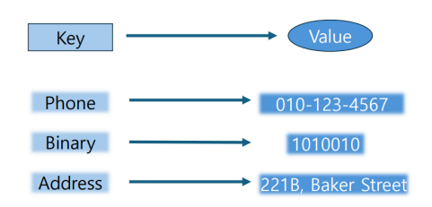
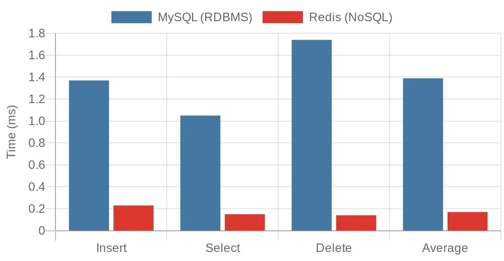

# ⚖️MySQL vs Redis Performance Benchmark

> 학술 논문 [MySQL과 Redis의 데이터 처리 성능 비교 평가 (JICS, 2024)] 실험 코드 레포지토리
> 저자: 방혁, 김서현, 전상훈

본 레포지토리는 관계형 데이터베이스(RDBMS, MySQL)와 인메모리 기반 NoSQL(Redis)의 데이터 처리 성능을 정량적으로 비교하기 위해 작성된 벤치마크 프로젝트입니다.
동일한 하드웨어 및 애플리케이션 로직 하에서 저장소 구조가 실제 CRUD Latency에 미치는 영향을 분석했습니다.

## 📋목차
1. [프로젝트 개요 및 배경](#1-프로젝트-개요-및-배경)
2. [설계 의도](#2-설계-의도)
3. [실험 환경 및 시나리오](#3-실험-환경-및-시나리오)
4. [프로젝트 구조](#4-프로젝트-구조)
5. [실행 방법](#5-실행-방법)
6. [실험 결과](#6-실험-결과)
7. [한계점 및 기술적 회고](#7-한계점-및-기술적-회고)

## 1. 프로젝트 개요 및 배경

대규모 트래픽을 처리하는 백엔드 시스템에서 데이터 저장소 선택은 성능의 핵심 변수입니다.
단순히 "NoSQL이 빠르다"는 통념을 넘어, "단순 CRUD 작업에서 Redis 도입이 RDBMS 대비 수치적으로 어느 정도의 이점을 주는가?"를 증명하여, 실무적인 캐싱 전략 수립의 근거를 마련하고자 했습니다.

### Architecture Comparison

| MySQL (Relational Model) | Redis (Key-Value Model) |
| :---: | :---: |
|  |  |
| 관계 중심 구조 (Join 기반 접근) 인덱스 탐색 및 디스크 I/O 발생 | Direct Key–Value 접근 구조 메모리 직접 접근으로 Latency 최소화 |

## 2. 설계 의도

단순한 API 호출 테스트가 아닌, 실험의 재현성과 변수 통제를 위해 다음과 같은 설계를 적용했습니다.

### 2.1 Template Method Pattern
두 데이터베이스의 측정 방식이 다르면 오차가 발생할 수 있습니다. 이를 방지하기 위해 AbstractBatchExperiment 추상 클래스를 설계하여 실험의 라이프사이클을 통제했습니다.

- Source: src/main/java/com/benchmark/core/AbstractBatchExperiment.java
- Design:
    - run() 메서드 내에서 워밍업, 타이머 측정, 로깅 흐름을 고정.
    - 하위 구현체(MysqlBatchExperiment, RedisBatchExperiment)는 순수 DB 연산 로직만 구현하도록 강제하여 측정 오차 최소화.

### 2.2 리소스 격리
정확한 Redis 성능 측정을 위해, Redis 실험 실행 시 RDBMS 관련 리소스가 메모리를 점유하거나 커넥션을 맺는 것을 차단했습니다.

- Source: src/main/resources/application-redis.yml
- Detail: Spring Boot의 autoconfigure.exclude 옵션을 사용하여 DataSource, Hibernate, TransactionManager 등 실험과 무관한 Bean 생성을 원천 차단했습니다.

## 3. 실험 환경 및 시나리오

### 3.1 Environment
* OS: Windows 11 (64bit)
* H/W: Intel Core i5-1340P, 16GB RAM
* Stack: Java 11, Spring Boot 2.7.16, Gradle 8.5
* Database: MySQL 8.0.33, Redis 6.4.0

### 3.2 Methodology
* Data Size: 총 10,000건의 데이터 (Integer Key-Value)
* Batch: 1,000건 단위로 나누어 평균 수행 시간(ms) 측정
* Operation:
    * MySQL: JdbcTemplate 사용, PK(ID) 기반 단건 처리 (인덱스 활용)
    * Redis: RedisTemplate 사용, Key(user:{id}) 기반 Direct Access

## 4. 프로젝트 구조

~~~bash
src/main/java/com/benchmark
├── core
│   └── AbstractBatchExperiment.java  # Template Method
├── mysql
│   ├── MysqlBatchExperiment.java     # JDBC 구현체
│   └── application-mysql.yml         # MySQL 연결 설정
├── redis
│   ├── RedisBatchExperiment.java     # RedisTemplate 구현체
│   ├── RedisConfig.java              # 직렬화 최적화
│   └── application-redis.yml         # Redis 연결 설정
└── BenchmarkApplication.java
~~~

## 5. 실행 방법

Gradle Wrapper를 사용하여 별도의 설치 없이 실행 가능합니다.

1. MySQL 벤치마크 실행
~~~bash
# Mac/Linux
./gradlew bootRun --args="--spring.profiles.active=mysql"

# Windows (CMD/PowerShell)
gradlew bootRun --args="--spring.profiles.active=mysql"
~~~

2. Redis 벤치마크 실행
~~~bash
# Mac/Linux
./gradlew bootRun --args="--spring.profiles.active=redis"

# Windows (CMD/PowerShell)
gradlew bootRun --args="--spring.profiles.active=redis"
~~~

> Note: 실행 시 Batch 1 - Insert Avg: ... 형태의 로그가 출력되며 각 단계별 소요 시간이 기록됩니다.

## 6. 실험 결과
논문 및 본 코드 실행을 통해 도출된 10,000회 연산 평균 수행 시간입니다. (수치가 낮을수록 고성능)

### 성능 비교 그래프

> Note: 파란색(왼쪽)은 MySQL, 빨간색(오른쪽)은 Redis입니다.

### 세부 지표

| Operation | MySQL (RDBMS) | Redis (NoSQL) | Speedup (Redis vs MySQL) |
| :---: | :---: | :---: | :---: |
| Insert | 1.37 ms | 0.23 ms | 5.84x Faster |
| Select | 1.05 ms | 0.15 ms | 6.61x Faster |
| Delete | 1.74 ms | 0.14 ms | 12.33x Faster |
| Average | 1.39 ms | 0.17 ms | 7.78x Faster |

### 결과 분석
- Disk I/O vs In-Memory: Redis는 디스크 I/O 대기 시간 없이 메모리에서 모든 연산이 수행되므로 압도적인 성능 차이를 보였습니다.
- Delete 성능: 특히 삭제 연산에서 약 12배의 성능 격차가 발생했는데, 이는 RDBMS가 데이터 삭제 시 인덱스를 재정렬하고 트랜잭션 로그를 기록하는 비용이 발생하기 때문으로 분석됩니다.

## 7. 한계점 및 기술적 회고

### 실험의 한계
- 네트워크 오버헤드: 로컬 환경에서의 측정이므로, 실제 클라우드 환경의 Network RTT가 반영되지 않았습니다.
- 트랜잭션 부재: RDBMS의 강점인 ACID 트랜잭션 보장과 복잡한 Join 연산 시나리오는 제외된 단순 CRUD 비교입니다.

### 시사점 및 배운 점

- 적재적소의 저장소 선택:   
단순 조회 성능이 최대 12배까지 차이나는 것을 확인하며, 세션이나 캐시 데이터는 Redis로, 데이터 정합성이 중요한 정보는 MySQL로 처리하는 하이브리드 아키텍처의 필요성을 체감했습니다.

- 설계의 중요성:   
실험 코드를 작성하며 Template Method Pattern으로 로직의 중복을 제거하고, Spring Profile로 테스트 환경을 격리하는 과정을 통해 견고한 애플리케이션 설계 역량을 향상시켰습니다.

- 데이터 기반 사고:   
"NoSQL이 빠르다"는 막연한 추측 대신, 자료구조(B-Tree vs Hash)의 차이가 실제 Latency에 어떻게 반영되는지 수치로 확인함으로써 기술 도입의 타당성을 설명할 수 있게 되었습니다.
