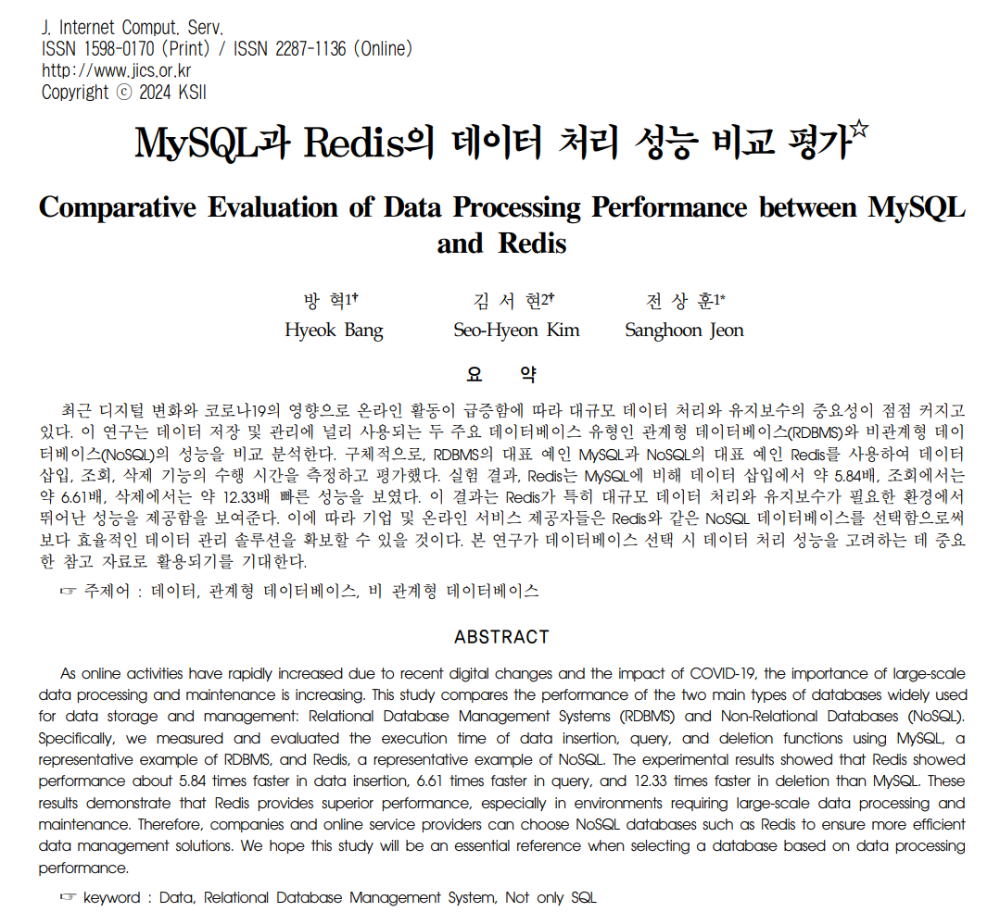
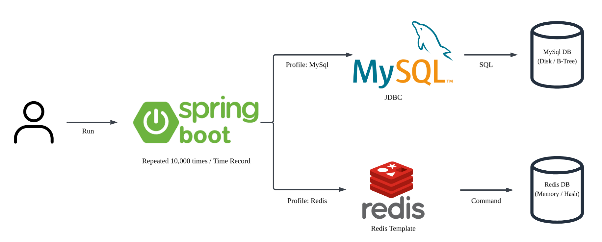

# ⚖️ MySQL vs Redis Performance Benchmark

RDBMS(MySQL)와 NoSQL(Redis)의 실제 CRUD 처리 성능을 비교/분석한 벤치마크 프로젝트입니다. 동일한 애플리케이션 로직 하에 Disk vs Memory의 차이가 실제 애플리케이션 Latency에 미치는 영향을 검증했습니다.
Redis가 MySQL에 비해 얼마나 빠른지 직접 환경을 구축하고 수치로 측정하여, 상황에 맞게 DB 선택을 하고자 했습니다.

## 📋 목차
1. [프로젝트 개요](#1-프로젝트-개요)
2. [실험 설계](#2-실험-설계)
3. [실험 환경](#3-실험-환경)
4. [프로젝트 구조](#4-프로젝트-구조)
5. [실행 방법](#5-실행-방법)
6. [실험 결과](#6-실험-결과)
7. [결론 및 고찰](#7-결론-및-고찰)

## 1. 프로젝트 개요

### 관련 논문
본 프로젝트는 실제 투고된 논문 [MySQL과 Redis의 데이터 처리 성능 비교 평가 (JICS, 2024)]의 실험 과정을 코드로 구현하고 검증한 결과입니다.

*(그림: JICS 2024에 게재된 논문 초록 및 저자 정보)*

### Disk vs Memory

| MySQL (RDBMS) | Redis (NoSQL) |
| :---: | :---: |
|  |  |
| **Disk I/O & B-Tree** 디스크 접근 및 인덱스 탐색 비용 발생 | **In-Memory & Hash** 메모리 직접 접근, Key-Value 조회 (O(1)) |

### 실험 아키텍처
비교의 공정성을 위해 동일한 Spring Boot 애플리케이션 내에서 Profile만 변경하여 테스트했습니다.

> - 실행 옵션에 따라 JdbcTemplate / RedisTemplate 선택
> - 공통 비즈니스 로직은 유지하고 하부 저장소 접근 기술만 변경하여 순수 성능 차이 측정

## 2. 실험 설계

### 1) 측정 지표
DB 내부의 쿼리 실행 시간(Execution Time)만이 아닌, 실제 백엔드 서버의 총 응답 시간을 측정했습니다.
- `Time = Serialization + Network I/O + DB Execution + Deserialization`

### 2) Test Workload
- JDBC Batch 기능 등의 최적화 기법을 배제하고, 순수하게 1회 호출 당 처리 속도를 비교하기 위해 10,000회의 Single Operation을 반복 수행했습니다.
- 실험 시작 전 Warm-up 과정을 거쳐 Connection Pool(HikariCP) 초기화 비용을 배제했으며, 풀 사이즈를 충분히 확보하여 Connection 대기 시간을 통제했습니다.
- `AbstractBatchExperiment` 클래스를 통해 워밍업, 시간 측정, 로깅 로직을 중앙화하여 구현체 별 측정 오차를 제거했습니다.

### 3) 리소스 격리
- Spring Profile 기능을 활용하여 테스트 대상이 아닌 DB의 Bean 생성을 차단(`autoconfigure.exclude`), 메모리 및 Connection Pool 간섭을 방지했습니다.

## 3. 실험 환경

- **OS:** Windows 11 (64bit)
- **CPU/RAM:** Intel Core i5-1340P, 16GB RAM
- **Tech Stack:** Java 11, Spring Boot 2.7.16, Gradle 8.5
- **DB Version:** MySQL 8.0.33, Redis 6.4.0
- **Data:** Integer Key-Value 데이터 10,000건
- **Scenario:** 1,000건 단위 순차 반복 실행 후 평균 수행 시간(ms) 측정

> **Why Localhost?**
> 네트워크 지연 변수를 최소화하고, 순수하게 Disk B-Tree vs In-Memory Hash의 차이에 집중하기 위해 로컬 환경에서 Loopback 통신으로 수행했습니다.

## 4. 프로젝트 구조

~~~bash
src/main/java/com/benchmark
├── core
│   └── [AbstractBatchExperiment.java](./src/main/java/com/benchmark/core/AbstractBatchExperiment.java)
├── mysql
│   ├── [MysqlBatchExperiment.java](./src/main/java/com/benchmark/mysql/MysqlBatchExperiment.java)     # JDBC 구현체
│   └── application-mysql.yml         # MySQL 설정
├── redis
│   ├── [RedisBatchExperiment.java](./src/main/java/com/benchmark/redis/RedisBatchExperiment.java)     # RedisTemplate 구현체
│   ├── [RedisConfig.java](./src/main/java/com/benchmark/redis/RedisConfig.java)             
│   └── application-redis.yml         # Redis 설정
└── BenchmarkApplication.java
~~~

## 5. 실행 방법

### Prerequisites
- **MySQL:** Port `3306`
- **Redis:** Port `6379`

### Run Benchmark

**1. MySQL 벤치마크**
~~~bash
# Mac/Linux
./gradlew bootRun --args="--spring.profiles.active=mysql"

# Windows (CMD/PowerShell)
gradlew bootRun --args="--spring.profiles.active=mysql"
~~~

**2. Redis 벤치마크**
~~~bash
# Mac/Linux
./gradlew bootRun --args="--spring.profiles.active=redis"

# Windows (CMD/PowerShell)
gradlew bootRun --args="--spring.profiles.active=redis"
~~~

## 6. 실험 결과

### 성능 비교 그래프

> **Note:** 파란색(좌) MySQL / 빨간색(우) Redis

### 상세 지표 및 분석

| Operation | MySQL (Disk/B-Tree) | Redis (Memory/Hash) | Speedup | Complexity |
| :---: | :---: | :---: | :---: | :---: |
| Insert | 1.37 ms | 0.23 ms | 5.8배 | O(log N) vs O(1) |
| Select | 1.05 ms | 0.15 ms | 6.6배 | O(log N) vs O(1) |
| Delete | 1.74 ms | 0.14 ms | 12.3배 | O(log N) vs O(1) |
| **Average** | **1.39 ms** | **0.17 ms** | **7.8배** | - |

### 결과 분석
특히 Delete 연산에서 12배 이상의 가장 큰 성능 격차가 발생했습니다.
- **MySQL:** 트랜잭션 보장을 위한 Undo Log 기록 및 삭제 후 B-Tree 인덱스 재정렬 비용이 발생합니다.
- **Redis:** Hash 구조상 키를 찾아 메모리 포인터만 해제하는 O(1) 연산이므로 오버헤드가 거의 없습니다.

## 7. 결론 및 고찰

### 연구의 한계
한계점은 다음과 같습니다.
- 논문에서 언급했듯 Redis는 Loose Consistency를 가집니다. 본 실험은 Latency 측정에 집중했으나, 데이터 무결성이 최우선인 환경에서는 RDBMS와의 트레이드오프를 고려해야 함을 상기했습니다.
- `System.currentTimeMillis()`를 사용하여 'ms' 단위의 체감 지연 시간을 측정했습니다. `System.nanoTime()`보다는, I/O가 포함된 애플리케이션 레벨의 경향성을 파악하는 데 집중했습니다.
- 실제 클라우드 환경의 RTT 미반영 및 Redis의 단일 스레드 아키텍처에서 대규모 동시 접속 시 발생할 수 있는 병목 현상은 검증 범위에서 제외되었습니다.

### Insights
결론은 다음과 같습니다.
1.  단순 조회 시 7.8배, 삭제 시 12배의 성능 격차를 확인함으로써, Read-Heavy 하거나 빈번한 갱신이 일어나는 데이터에 대한 Redis 캐싱 전략이 비용 대비 높은 효율을 낸다는 것을 검증했습니다.
2.  동일한 로직이라도 하드웨어 상태와 초기화 변수에 따라 결과가 달라질 수 있음을 인지했습니다. 따라서 `Template Method` 패턴으로 로직을 통제하고 환경을 격리하는 것이 데이터의 신뢰도 확보에 필수적임을 배웠습니다.

### Future Work
향후 연구 과제는 다음과 같습니다.
- 현재의 MySQL vs Redis 비교를 넘어, MongoDB 등 다양한 NoSQL 유형과의 성능 비교를 통해 데이터 성격에 따른 최적의 DB 선택 전략을 수립할 예정입니다.
- 현재의 Java 11 / Spring Boot 2.7 환경을 Java 17+ 및 Spring Boot 3.x로 마이그레이션하여, `Record` 클래스 등을 활용한 DTO 경량화 및 최신 GC 성능 개선 효과를 추가로 검증할 계획입니다.
- 평균 응답 시간 외에 P95, P99 지표를 추가하여 간헐적인 Jitter 현상을 분석할 예정입니다.
